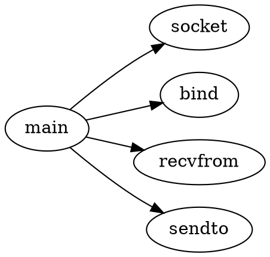

最基本的用法是用于描述函数调用关系.


## 基本示例

图中描述了简单的udp server 程序的函数调用关系.



## 编译命令

```bash

dot -Tpng test.dot -o test.png

```

### 编译makefile

如果目录下有多个dot 文件，可以通过makefile 实现批量编译.

```makefile
DOT_FILES := $(wildcard *.dot)
PUML_FILES := $(wildcard *.puml)

DOT_PNG_FILES := $(DOT_FILES:.dot=_dot.png)
PUML_PNG_FILES := $(PUML_FILES:.puml=_puml.png)

PNG_FILES := $(DOT_PNG_FILES) $(PUML_PNG_FILES)

all: $(PNG_FILES)

%_dot.png: %.dot
	dot -Tpng $< -o $@

%_puml.png: %.puml
	java -jar /opt/plantuml.jar -tpng $<
	mv $*.png $@


clean:
	rm -f *.png

.PHONY: all clean

```

