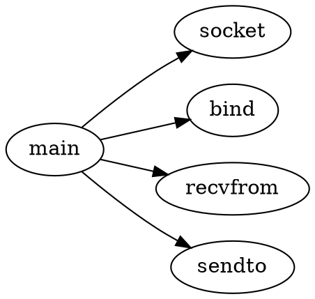

最基本的用法是用于描述函数调用关系.


## 基本示例

图中描述了简单的udp server 程序的函数调用关系.



## 编译命令

```bash

dot -Tpng test.dot -o test.png

```

### 编译makefile

如果目录下有多个dot 文件，可以通过makefile 实现批量编译.

```makefile

DOT_FILES := $(wildcard *.dot)
PUML_FILES := $(wildcard *.puml)
PNG_FILES := $(DOT_FILES:.dot=.png) $(PUML_FILES:.puml=.png)

all: $(PNG_FILES)

%.png: %.dot
	dot -Tpng $< -o $@

%.png: %.puml
	plantuml -tpng $<

clean:
	rm -f *.png

.PHONY: all clean

```

