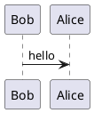

`plantUML` 是一种类似于`graphviz`的做图工具，通过代码，生成图像。


## 命令行安装

命令行安装的版本比较老，有些图编译的时候会报错，推荐从过网上下载最新版本。

### 安装

```bash
sudo apt install plantuml
```


### 使用

源码文件`demo.puml`




图片生成命令。

```bash
# 生成png文件
plantuml -tpng demo.puml
# 生成svg文件
plantuml -tsvg demo.puml
# 生成txt文件
plantuml -ttxt demo.puml
```


执行后，会在本地生成相应尾缀的图片文件。


## 网络下载最新版本

* 下载最新版本，[下载链接](#https://plantuml.com/download)，下载其中的`GPL` 版本

* 下载之后通过命令编译

  ```bash
  # 编译生成svg文件
  java -jar ~/Downloads/plantuml-1.2025.2.jar -tsvg demo.puml
  ```

* 封装脚本到`/usr/local/bin/plantuml`

  ```bash
  #! /bin/bash
  
  java -jar ~/Downloads/plantuml-1.2025.2.jar $@
  ```


## 附录

### 参考资料

* man手册
* [PlantUML 语言参考指引](#https://plantuml.com/en/guide)


