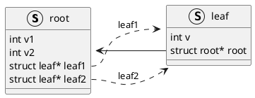

## 示例代码



## 编译

```bash
java -jar /opt/plantuml.jar -tpng demo.puml
```

### 编译makefile

如果同一目录下有多个`puml` 文件，可以通过makefile 批量编译.

此处提供了一个makefile，可以同时支持dot、puml 文件的编译.

```makefile
DOT_FILES := $(wildcard *.dot)
PUML_FILES := $(wildcard *.puml)
PNG_FILES := $(DOT_FILES:.dot=.png) $(PUML_FILES:.puml=.png)

all: $(PNG_FILES)

%.png: %.dot
	dot -Tpng $< -o $@

%.png: %.puml
    java -jar /opt/plantuml.jar -tpng $<

clean:
	rm -f *.png

.PHONY: all clean

```

