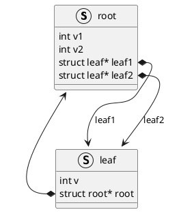

## 代码示例

###  结构体关系图

```puml
@startuml

struct root {
  int v1
  int v2
  struct leaf* leaf1
  struct leaf* leaf2
}

struct leaf {
  int v
  struct root* root
}

root::leaf1 *--> leaf : "leaf1"
root::leaf2 *--> leaf : "leaf2"
leaf::root *--> root

@enduml
```

